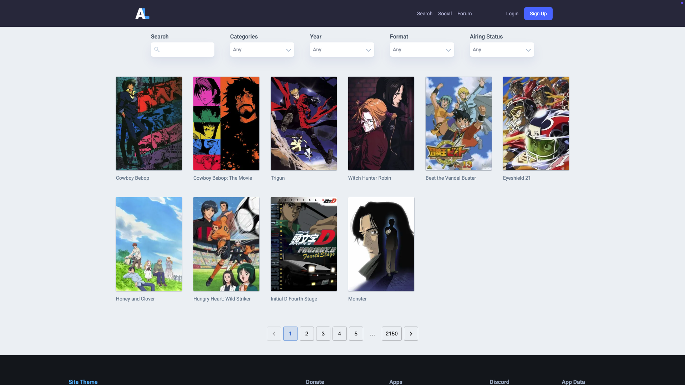

<h1>Turivius Project</h1>

<h3>Descrição</h3>

Esse é um projeto *take-home* construído com [React](https://reactjs.org/) e Context API, inspirado na plataforma da comunidade de animes [AniList](https://anilist.co/), utilizando a API pública do [Kitsu](https://kitsu.docs.apiary.io/).

O objetivo é demonstrar habilidades modernas de desenvolvimento frontend com React, implementando todos os requisitos solicitados:

✅ Página inicial com carrossel de destaques e categorias  
✅ Link "Ver todos" direcionando para listagem completa  
✅ Página de listagem paginada de animes  
✅ Página de busca com resultados dinâmicos  
✅ Página de detalhes com informações completas e trailer (quando disponível)  
✅ Página por categoria exibindo todos os animes relacionados  
✅ Consumo da API do Kitsu com integração de dados

👉 [Acesse o projeto ao vivo](https://turi-project.vercel.app/)

<p align="center">
  <figure style="display:inline-block; margin:10px;">
    <figcaption align="center"><strong>Carrossel</strong></figcaption>
    
  </figure>
  
  <figure style="display:inline-block; margin:10px;">
    <figcaption align="center"><strong>Detalhes do Anime</strong></figcaption>
  </figure>
    
    
  <figure style="display:inline-block; margin:10px;">
    figcaption align="center"><strong>Resultados de Busca</strong></figcaption>
    
    <
  </figure>
</p>

---

## Highlights

- OpenAI (GPT) para reescrita de descrições de animes de forma mais fluida e personalizada

- Context API para gerenciamento de estado global

- React Query para fetch e cache eficiente dos dados da API

- Material UI

- Componente de carrossel

- Skeletons para carregamento

- Botões estilizados

- Tailwind CSS para estilização e responsividade

- Kitsu API como fonte dos dados


## 🚀 Como rodar o projeto localmente

```bash
npm install
npm run dev
```

## Environment Variables

Crie um arquivo `.env` com a seguinte variável:
```bash
OPENAI_API_KEY=
```


Depois, acesse: http://localhost:3000


<h2>📌 Pontos de Melhoria</h2>
- O código pode ser refatorado, eliminando componentes que se tornaram desnecessários, como parte do Context.

- Algumas chamadas à API são redundantes e podem ser otimizadas.

- A experiência do usuário pode ser melhorada com ajustes de animações (ex: dropdowns).


