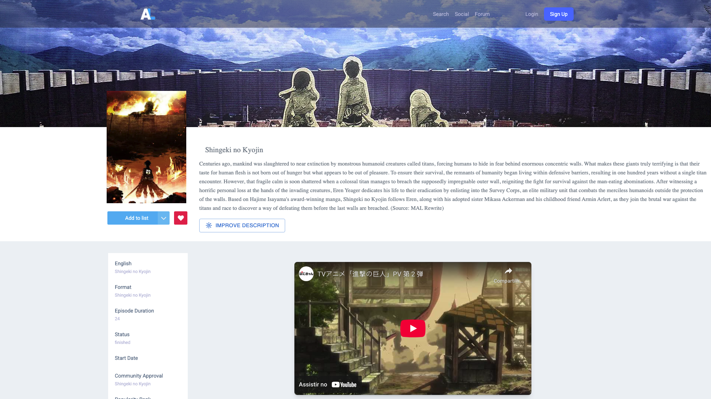
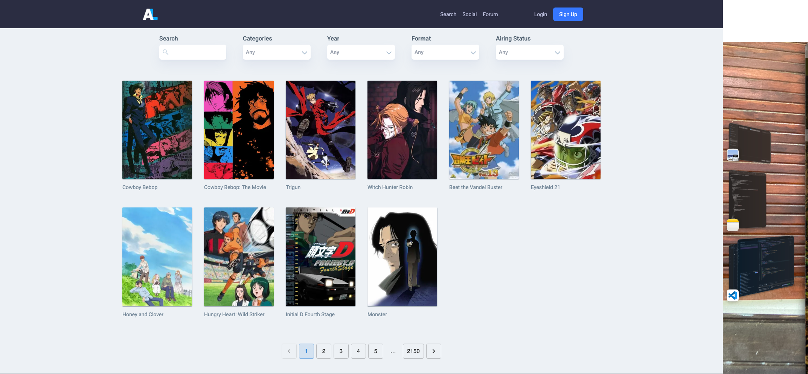

<h1>Turivius Project</h1>

<h3>Descrição</h3>

Esse é um projeto *take-home* construído com [React](https://reactjs.org/) e Context API, inspirado na plataforma da comunidade de animes [AniList](https://anilist.co/), utilizando a API pública do [Kitsu](https://kitsu.docs.apiary.io/).

O objetivo é demonstrar habilidades modernas de desenvolvimento frontend com React, implementando todos os requisitos solicitados:

✅ Página inicial com carrossel de destaques e categorias  
✅ Link "Ver todos" direcionando para listagem completa  
✅ Página de listagem paginada de animes  
✅ Página de busca com resultados dinâmicos  
✅ Página de detalhes com informações completas e trailer (quando disponível)  
✅ Página por categoria exibindo todos os animes relacionados  
✅ Consumo da API do Kitsu com integração de dados

👉 [Acesse o projeto ao vivo](https://aniland.vercel.app/)

<p align="center">
  <figure style="display:inline-block; margin:10px;">
    
    <figcaption align="center"><strong>Página Inicial</strong></figcaption>
  </figure>
  <figure style="display:inline-block; margin:10px;">
    
    <figcaption align="center"><strong>Detalhes do Anime</strong></figcaption>
  </figure>
  <figure style="display:inline-block; margin:10px;">
    
    <figcaption align="center"><strong>Resultados de Busca</strong></figcaption>
  </figure>
</p>
---

🧠 Tecnologias e Ferramentas Utilizadas
React

Context API para gerenciamento de estado global

React Query para fetch e cache eficiente dos dados da API

Material UI

Componente de carrossel

Skeletons para carregamento

Botões estilizados

Tailwind CSS para estilização e responsividade

OpenAI (GPT) para reescrita de descrições de animes de forma mais fluida e personalizada

Kitsu API como fonte dos dados


## 🚀 Como rodar o projeto localmente

```bash
npm install
npm run dev
```

Depois, acesse: http://localhost:3000


<h2>Technical Notes</h2>

<h2>🛠 Notas Técnicas</h2>
Gerenciamento de estado com Context API e custom hooks

Layout construído com Tailwind CSS

Componentes e interações com Material UI

Boas práticas com componentes reutilizáveis e estrutura modular


<h2>📌 Pontos de Melhoria</h2>
A arquitetura geral pode ser aprimorada para melhor escalabilidade e organização.

Algumas chamadas à API são redundantes, como na Home, onde os dados já estão armazenados no Context. Isso poderia ser evitado com memoização ou cache mais eficiente.

Uma separação mais clara entre lógica de UI e lógica de dados (ex: dividir melhor camadas de domínio e apresentação) poderia trazer mais clareza.


